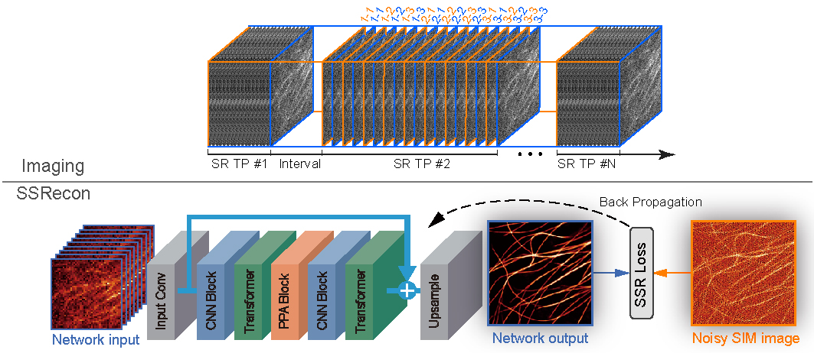

# SSR-SIM: Bio-friendly and high-precision super-resolution imaging through self-supervised reconstruction structured illumination microscopy

[Paper](https://www.nature.com/nmeth/) | [Dataset](https://figshare.com/articles/dataset/SSR-SIM_Dataset/30406366)

> *Deep learning-based structured illumination microscopy (SIM) has demonstrated substantial potential in long-term super-resolution imaging of biostructures, enabling the study of subcellular dynamics and interactions in live cells. However, the acquisition of ground-truth data for training poses inherent challenges, limiting its universal applicability. Current approaches without using ground-truth training data compromise reconstruction fidelity and resolution, and the lack of physical priors in end-to-end networks further limits these qualities. Here we developed self-supervised reconstruction (SSR)-SIM by combining statistical analysis of reconstruction artifacts with structured light modulation priors to eliminate the need for ground truth and improve reconstruction precision. We validated the superiority of SSR-SIM on common biological datasets and demonstrated that SSR-SIM enabled long-term recording of dynamic events, including cytoskeletal remodeling in cell adhesion, mitochondrial cristae remodeling, interactions between viral glycoprotein and endoplasmic reticulum, endocytic recycling of transferrin receptors, vaccinia virus-induced actin comet remodeling, and the mitochondrial intercellular transfer via tunneling nanotubes.* 
>

  

---

### Evaluating SSR-SIM on BioSR dataset

- Download BioSR dataset, "Microtubules.zip", "CCPs.zip" and, "F-actin.zip", from [Link](https://figshare.com/articles/dataset/BioSR/13264793), 

- Unzip them to path: path="home/BioSR" (Linux) or path=r"K:\BioSR" (Win)

- Install of dependencies required following [requirements](requirements.txt)

- See SIR_core/ReadMe.txt to configure binary reconstruction package (for python 3.8 and 3.10).

- Run Demo/Demo_Train_SSRSIM_On_BioSR.py

### Zero-Shot SSR-SIM imaging of F-actin (mEmerald-LifeAct) in COS-7 cells

- Download LifeAct dataset (30 timepoints by using SSR-SIM imaging SSR-SIM ) from [Link](https://drive.google.com/file/d/1VMe_RfTZg3eaEyo8XUrgNZau775pvE88/view?usp=drive_link)

- Unzip them to path like: path="home/LifeAct" (Linux) or path=r"K:\LifeAct" (Windows)

- Install of dependencies required following [requirements](requirements.txt)

- See SIR_core/ReadMe.txt to configure binary reconstruction package (for python 3.8 and 3.10).

- Run Demo/Demo_ZeroShot_LifeAct.py

### json path

This code is written and tested in PyCharm, Windows and Linux. If the error ".mrc files cannot be found" occurs when running the code in other manners, it indicates that the relative path of the .jsons file is incorrect. Users can modify the json files in the SIR_options and SSR_options by removing the "..\\" to resolve this issue.

## Citation
If you use SSR-SIM, please consider citing:

    @article{,
      title={"Bio-friendly and high-precision super-resolution imaging through self-supervised reconstruction structured illumination microscopy"},
      author={"Jiahao Liu, Xue Dong, Huaide Lu, Tao Liu, Wei Liu, Xinyao Hu, Quan Meng, Amin Jiang, Tao Jiang, Xiaohan Geng, Haosen Liu, Jun Cheng, Edmund Y. Lam, Yan-Jun Liu*, Shan Tan*, Dong Li*"},
      journal={"Nature Methods"},
      year={"2025"}
    }

